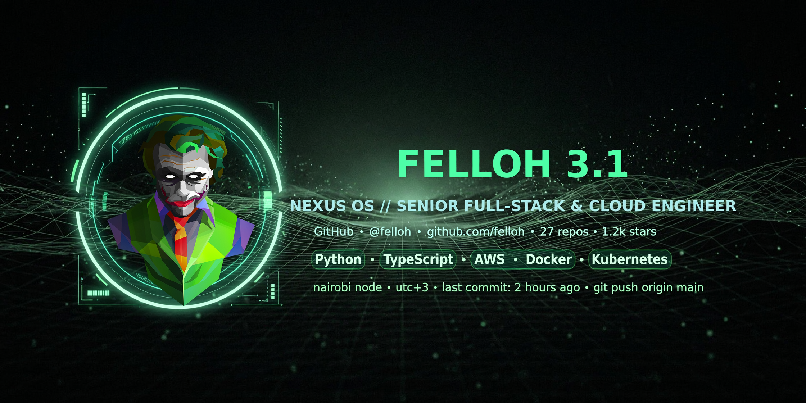

<p align="center">
  
</p>

<p align="center">
  <a href="https://git.io/typing-svg">
    
  </a>
</p>


<p align="center">
  <a href="https://fellow3-1.github.io/Fellow3-1/" target="_blank" rel="noopener noreferrer">
    
  </a>
</p>

<p align="center">
  <a href="https://fellow3-1.github.io/Fellow3-1/" target="_blank" rel="noopener noreferrer">
    
  </a>
</p>

<p align="center">
  <a href="https://github.com/Fellow3-1?tab=followers">
    
  </a>
  <a href="https://github.com/Fellow3-1?tab=repositories">
    
  </a>
</p>

<p align="center">
  
</p>

---

## 📊 GitHub Stats & Analytics

<p align="center">
  <a href="https://github.com/Fellow3-1">
    
  </a>
</p>

<p align="center">
  <a href="https://github.com/Fellow3-1?tab=repositories">
    
  </a>
  <a href="https://github.com/Fellow3-1">
    
  </a>
</p>

<p align="center">
  <a href="https://github.com/Fellow3-1">
    
  </a>
</p>

### 🏆 GitHub Trophies

<p align="center">
  <a href="https://github.com/Fellow3-1">
    
  </a>
</p>

---

## 🕹️ Mini Games & Interactive Zone

### 🐍 GitHub Contribution Snake
<p align="center">
  <picture>
    <source media="(prefers-color-scheme: dark)" srcset="https://raw.githubusercontent.com/Fellow3-1/Fellow3-1/main/github-snake-dark.svg" />
    <source media="(prefers-color-scheme: light)" srcset="https://raw.githubusercontent.com/Fellow3-1/Fellow3-1/main/github-snake.svg" />
    
  </picture>
</p>

### 🎮 Developer RPG Character Sheet
```text
 ╔══════════════════════════════════════════════════════════════════════════╗
 ║                         FELLOH - LEVEL 99 DEV                            ║
 ╠══════════════════════════════════════════════════════════════════════════╣
 ║  HP  : ██████████████████ 100%  │ Class     : Full-Stack Sorcerer        ║
 ║  MP  : ██████████████████ 100%  │ Sub-Class : Cloud & AI Specialist      ║
 ║  EXP : ██████████████░░░░  85%  │ Weapon    : Neovim & TypeScript        ║
 ║  STAMINA : ☕ Infinite Coffee   │ Armor     : Docker & Kubernetes        ║
 ╚══════════════════════════════════════════════════════════════════════════╝
```

---

## 🛠️ Tech Stack & Skills Matrix

### 🚀 Programming Languages


### 🎨 Frontend & UI Frameworks


### ⚙️ Backend & APIs


### 🗄️ Databases & ORMs


### 🤖 AI & Machine Learning


### ☁️ Cloud, DevOps & Infrastructure


### 📱 Mobile & Cross-Platform


### 🛠️ Tools, IDEs & Utilities


### 🎨 Design & Prototyping


### 🌐 Communities & Developer Platforms


---

## ⚡ Quick Bio & Interests

- 🔭 I’m currently working on modern full-stack web and mobile applications.
- 🌱 I’m currently learning AI/LLM integration and Cloud-Native architectures.
- 👯 I’m looking to collaborate on open-source projects and developer tools.
- 💬 Ask me about Web Development, React, Python, Systems, and UI/UX design.
- ⚡ Fun fact: I turn coffee into clean, efficient, and readable code.

---

## 📫 Connect With Me

<p align="center">
  <a href="https://github.com/Fellow3-1" target="_blank" rel="noopener noreferrer">
    
  </a>
  <a href="https://twitter.com/Fellow3_1" target="_blank" rel="noopener noreferrer">
    
  </a>
  <a href="mailto:felixodhiambo31@live.com">
    
  </a>
</p>
